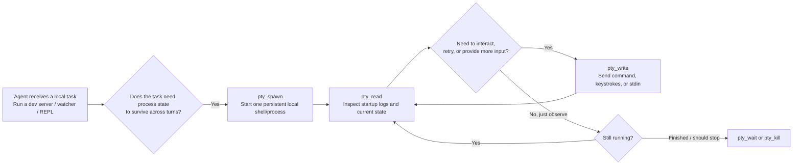
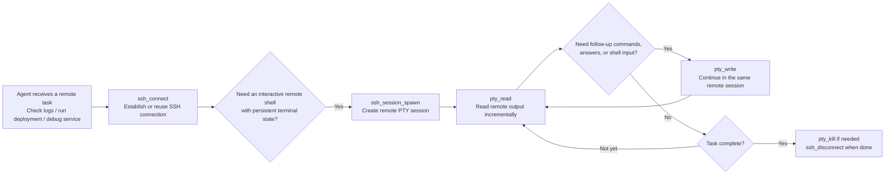
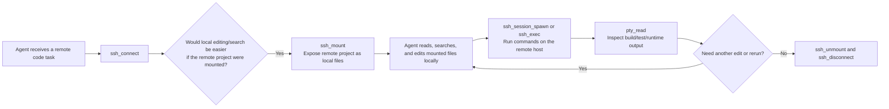

# PTY MCP

`pty-mcp` is an MCP server for managing local PTY sessions and SSH-backed remote workflows over stdio. It is meant for MCP clients (Claude Code, Codex, OpenCode, etc.) that need persistent terminal and SSH state instead of one-shot shell execution.

With `pty-mcp`, a client can:

- start a terminal session once and keep using it across multiple calls
- read buffered output incrementally instead of losing process state between commands
- send follow-up input into the same local or remote shell
- manage SSH connections, remote sessions, remote files, and remote directories through one MCP surface
- mount a remote project locally and combine local editing with remote execution

This makes workflows like dev servers, watch tasks, remote debugging, and near-local remote development much easier to drive.

## Installation

Using Cargo:

```bash
cargo install pty-mcp
```

Using Homebrew:

```bash
brew tap observerw/tap
brew install observerw/tap/pty-mcp
```

From source:

```bash
cargo build --release
```

The binary will be available at `target/release/pty-mcp`.

## Usage

Add the MCP server to your Codex config:

```toml
[mcp_servers.pty]
command = "pty-mcp"
```

If you want to run a locally built binary instead:

```toml
[mcp_servers.pty]
command = "/absolute/path/to/pty-mcp/target/release/pty-mcp"
```

The server communicates over stdio and reads configuration from environment variables.

## Typical Workflows

These flows are best understood from the MCP client's point of view: an agent receives a task, decides whether it needs persistent terminal state, remote access, or a mounted workspace, and then keeps interacting with the same session instead of starting over each turn.

### Scenario: keep a local dev process alive across turns

Use this when the agent needs to start something like `pnpm dev`, `cargo watch`, a test watcher, or a REPL, then come back later to inspect logs or send more input.



### Scenario: investigate or operate on a remote machine interactively

Use this when the agent needs a real remote shell that it can return to, instead of one-shot SSH execution with no retained terminal state.



### Scenario: edit locally, execute remotely

Use this when the agent wants local-quality file access for search and editing, while still running build, test, or runtime commands on the remote host.



## Tool Surface

### PTY tools

- `pty_spawn`: start a local PTY process
- `pty_write`: send input to a running PTY session
- `pty_read`: page through retained output, optionally filtering by regex pattern
- `pty_list`: list known PTY sessions
- `pty_kill`: stop a PTY session with `sigint`, `sigterm`, or `sigkill`
- `pty_wait`: wait for a PTY session to exit

`pty_read` and initial output capture support three views:

- `plain`: ANSI stripped text
- `ansi`: ANSI-preserving text
- `raw`: raw buffer view

### SSH tools

- `ssh_connect`: create or reuse an SSH connection handle
- `ssh_list`: list SSH connections and mounts
- `ssh_session_spawn`: start a remote PTY session over an existing SSH connection
- `ssh_exec`: run a remote script over an existing SSH connection
- `ssh_read_file`: read a UTF-8 text file from the remote host
- `ssh_write_file`: write a UTF-8 text file to the remote host
- `ssh_list_dir`: list one remote directory level
- `ssh_mkdir`: create a remote directory
- `ssh_mount`: mount a remote path locally through `sshfs`
- `ssh_unmount`: unmount a mounted remote path
- `ssh_disconnect`: disconnect and optionally clean up related resources

#### SSH mount requirements

`ssh_mount` depends on the local machine being able to mount a remote filesystem.

To use it locally, you need:

- a FUSE implementation installed and available
- `sshfs` installed and available in `PATH`, or configured via `PTY_MCP_SSHFS_BIN_PATH`

In practice:

- macOS: `macFUSE` and `sshfs`
- Linux: `fuse` or `fuse3`, plus `sshfs`

Without local FUSE support and `sshfs`, SSH connections and remote command execution can still work, but `ssh_mount` will not.

## MCP Resources

The server also exposes structured resources:

- `pty://sessions`
- `pty://sessions/{id}`
- `pty://sessions/{id}/buffer`
- `pty://sessions/{id}/tail`
- `ssh://connections`
- `ssh://connections/{id}`
- `ssh://mounts`
- `ssh://mounts/{id}`
- `ssh://docs/mount-setup`
- `ssh://docs/mount-setup/{platform}`

These are useful when the client wants a snapshot without invoking a tool.

The SSH mount setup guides are meant for agents: when `sshfs`/FUSE support is missing, the
agent can read these resources and then guide the user through the right local installation flow
for the current platform instead of guessing.

## Runtime Requirements

### PTY

Local PTY support is built in. Commands are subject to policy checks for:

- allowed working-directory roots
- allowed/denied commands
- allowed/denied environment variables

### SSH

SSH features depend on host binaries:

- `ssh` is required for SSH connections and remote execution
- `sshfs` is required for `ssh_mount`
- `umount` is used for unmounting
- `diskutil` is additionally probed on macOS

On macOS, the server also probes `macFUSE` / `osxfuse` availability as part of SSH mount capability detection.

## Configuration

All configuration is read from environment variables at startup.

### Core settings

- `PTY_MCP_SESSION_LIMIT`: max number of tracked PTY sessions, default `32`
- `PTY_MCP_DEFAULT_READ_LIMIT`: default line count for reads, default `200`
- `PTY_MCP_MAX_BUFFER_LINES`: retained lines per session buffer, default `50000`
- `PTY_MCP_ALLOWED_CWD_ROOTS`: colon-separated allowed working-directory roots, default current directory
- `PTY_MCP_ALLOWED_COMMANDS`: comma-separated allowlist of command names
- `PTY_MCP_DENIED_COMMANDS`: comma-separated denylist of command names
- `PTY_MCP_ALLOWED_ENV_VARS`: comma-separated allowlist of env var names
- `PTY_MCP_DENIED_ENV_VARS`: comma-separated denylist of env var names

By default, the following env vars are denied:

- `LD_PRELOAD`
- `LD_LIBRARY_PATH`
- `DYLD_INSERT_LIBRARIES`
- `DYLD_LIBRARY_PATH`

### SSH settings

- `PTY_MCP_SSH_BIN_PATH`: explicit path to `ssh`
- `PTY_MCP_SSHFS_BIN_PATH`: explicit path to `sshfs`
- `PTY_MCP_UMOUNT_BIN_PATH`: explicit path to `umount`
- `PTY_MCP_DISKUTIL_BIN_PATH`: explicit path to `diskutil`
- `PTY_MCP_SSH_MANAGED_MOUNT_ROOT`: managed local root for SSH mounts
- `PTY_MCP_SSH_ALLOWED_HOSTS`: comma-separated host allowlist, supports `*` and `*.example.com`
- `PTY_MCP_SSH_DENIED_HOSTS`: comma-separated host denylist
- `PTY_MCP_SSH_ALLOWED_USERS`: comma-separated SSH user allowlist
- `PTY_MCP_SSH_ALLOWED_AUTH_KINDS`: comma-separated auth allowlist, values: `host_alias`, `ssh_agent`, `identity_path`
- `PTY_MCP_SSH_ALLOW_EXPLICIT_MOUNT_PATHS`: whether arbitrary local mount paths are allowed, default `true`
- `PTY_MCP_SSH_ALLOWED_MOUNT_ROOTS`: colon-separated allowed local mount roots
- `PTY_MCP_SSH_PORT_MIN`: minimum allowed SSH port, default `1`
- `PTY_MCP_SSH_PORT_MAX`: maximum allowed SSH port, default `65535`

When `PTY_MCP_SSH_MANAGED_MOUNT_ROOT` is set, it is automatically added to the allowed cwd roots and mount roots.

## Example

Example with a tighter policy:

```toml
[mcp_servers.pty]
command = "pty-mcp"

[mcp_servers.pty.env]
PTY_MCP_ALLOWED_CWD_ROOTS = "/Users/alice/work:/tmp/pty-mcp"
PTY_MCP_ALLOWED_COMMANDS = "bash,sh,python,node,cargo"
PTY_MCP_SSH_ALLOWED_HOSTS = "*.example.com,github.com"
PTY_MCP_SSH_ALLOWED_USERS = "alice"
PTY_MCP_SSH_MANAGED_MOUNT_ROOT = "/tmp/pty-mcp-mounts"
```

## Development

```bash
cargo build
```

## Release Automation

GitHub Actions includes:

- `CI`: runs `cargo fmt --check`, `cargo clippy`, and `cargo test`
- `Release`: on tags like `v0.1.0`, builds release archives for macOS (Intel + Apple Silicon) and Linux (x86_64), publishes a GitHub Release, and updates the Homebrew tap formula

To enable tap updates, add this repository secret:

- `HOMEBREW_TAP_GITHUB_TOKEN`: a token with push access to the tap repository

By default, the release workflow pushes the formula to `${owner}/homebrew-tap` at `Formula/pty-mcp.rb`. You can override either path with repository variables:

- `HOMEBREW_TAP_REPOSITORY`
- `HOMEBREW_TAP_FORMULA_PATH`

## License

MIT
