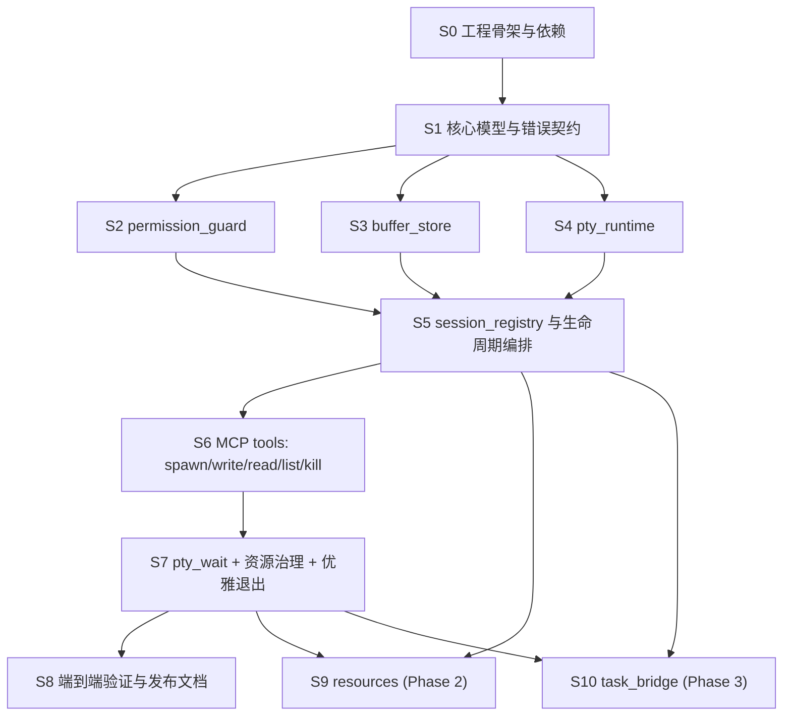

# IMPL.md

## 目标与范围

本文档把 [`DESIGN.md`](/Users/wangbowei/workspace/pty-mcp/docs/DESIGN.md) 落成可执行的实现计划，优先覆盖第一阶段的 **tool-first PTY MCP server**，并为第二阶段 `resources`、第三阶段 `tasks` 预留明确边界。

当前仓库已经具备完整的第一阶段基础实现（tool-first 主路径），并在测试中覆盖核心生命周期流程。

## 当前进度

截至当前代码状态，已经完成的内容：

- `S0` 已完成：`lib + bin` 结构、`rmcp` stdio service、日志与配置加载已落地
- `S1` 已完成：核心 session 模型与结构化错误码已稳定
- `S2` 已完成：`permission_guard`（命令/cwd/env 策略）已落地并有测试覆盖
- `S3` 已完成：`buffer_store`（分页/过滤/视图/裁剪）已落地并有测试覆盖
- `S4` 已完成：`portable-pty` runtime（spawn/write/signal/wait）已落地并有测试覆盖
- `S5` 已完成：registry 生命周期编排（spawn/running/exited/killed/cleanup）已落地
- `S6` 已完成：六个 tools 均可用，`spawn/write/read/list/kill` 主路径可用
- `S7` 已完成：`pty_wait`、session 资源限制、server 退出清理已接入
- `S8` 已完成：契约与生命周期端到端测试、README 与实现文档已补齐
- `S9` 已完成：MCP `resources` 已提供只读会话/缓冲区快照
- `S10` 已完成：MCP `task_bridge` 已通过 `rmcp` task handler 作为可选增强接入

## 实现目标

第一阶段发布必须满足：

- 仅依赖 MCP `tools` 即可完成 `spawn -> read/wait -> write -> list -> kill`
- 支持长期运行进程、一次性命令、交互式 shell
- 输出为 LLM 友好的分页/过滤/状态摘要，而不是裸字节流
- 错误具有稳定错误码，而不是仅返回自由文本
- 具备基础的权限控制和资源治理能力

第二阶段和第三阶段是增强项：

- 第二阶段：只读 `resources`
- 第三阶段：`tasks` 映射层

## 推荐代码布局

建议把当前单文件二进制拆成“可测试的库 + 薄入口”结构：

```text
src/
  main.rs
  lib.rs
  app.rs
  config.rs
  error.rs
  session/
    mod.rs
    model.rs
    registry.rs
  pty/
    mod.rs
    runtime.rs
  buffer/
    mod.rs
    store.rs
    view.rs
  permission/
    mod.rs
    guard.rs
    policy.rs
  mcp/
    mod.rs
    service.rs
    tools.rs
    resources.rs   # Phase 2
    tasks.rs       # Phase 3
tests/
  model_contract.rs
  permission_guard.rs
  buffer_store.rs
  tool_contract.rs
  session_lifecycle.rs
```

布局原则：

- [`src/main.rs`](/Users/wangbowei/workspace/pty-mcp/src/main.rs) 只负责日志初始化、配置加载、传输启动、优雅退出
- 业务逻辑全部进入 [`src/lib.rs`](/Users/wangbowei/workspace/pty-mcp/src/lib.rs) 暴露的模块
- MCP 层只做 schema、参数解包、错误映射，不直接持有 PTY 细节
- `session_registry`、`pty_runtime`、`buffer_store`、`permission_guard` 保持独立，避免后续做 `resources/tasks` 时互相缠绕

## 建议依赖

在现有依赖基础上，第一阶段建议新增：

- `serde`, `serde_json`, `schemars`
- `thiserror`
- `tracing`, `tracing-subscriber`
- `uuid`
- `chrono`
- `regex`
- 一个 PTY 后端 crate，建议优先评估 `portable-pty`

依赖原则：

- PTY 后端只放在 `pty_runtime` 内部，不泄漏到其他模块
- 所有 MCP 入参/出参使用 `serde + schemars`，和 `rmcp` 的 tool schema 自动生成对齐

## 实施 DAG

下面的 DAG 表示推荐的落地顺序，不是运行时架构图。



并行建议：

- `S2`、`S3`、`S4` 可以在 `S1` 完成后并行推进
- `S9`、`S10` 必须建立在第一阶段稳定之后，不能反过来驱动核心设计

## 任务步骤

### S0. 工程骨架与依赖

状态：

- 已完成

依赖：

- 无

代码改动范围：

- [`Cargo.toml`](/Users/wangbowei/workspace/pty-mcp/Cargo.toml)
- [`src/main.rs`](/Users/wangbowei/workspace/pty-mcp/src/main.rs)
- [`src/lib.rs`](/Users/wangbowei/workspace/pty-mcp/src/lib.rs)
- [`src/app.rs`](/Users/wangbowei/workspace/pty-mcp/src/app.rs)
- [`src/config.rs`](/Users/wangbowei/workspace/pty-mcp/src/config.rs)
- [`src/mcp/mod.rs`](/Users/wangbowei/workspace/pty-mcp/src/mcp/mod.rs)

任务内容：

- 把当前项目从“单文件 bin”调整为“bin + library”结构
- 补齐第一阶段所需依赖、日志、配置加载和共享 `AppState`
- 明确默认传输为 stdio，保证对 Codex/OpenCode 的主路径兼容
- 预留 `mcp/service.rs` 作为 `rmcp` server 封装入口

验收标准：

- `cargo check` 通过
- 二进制进程可启动并初始化 MCP service，不因空实现 panic
- 新增模块骨架后，后续步骤不需要再改动入口形态

### S1. 核心模型与错误契约

状态：

- 已完成

依赖：

- `S0`

代码改动范围：

- [`src/error.rs`](/Users/wangbowei/workspace/pty-mcp/src/error.rs)
- [`src/session/mod.rs`](/Users/wangbowei/workspace/pty-mcp/src/session/mod.rs)
- [`src/session/model.rs`](/Users/wangbowei/workspace/pty-mcp/src/session/model.rs)
- [`tests/model_contract.rs`](/Users/wangbowei/workspace/pty-mcp/tests/model_contract.rs)

任务内容：

- 定义 `SessionId`、`SessionStatus`、`ExitInfo`、`BufferStats`、`SessionSummary`
- 定义第一阶段工具入参/出参会共享的领域对象，例如 `ReadView`、`Pagination`、`SignalKind`
- 设计稳定错误码，至少覆盖：
  - `SESSION_NOT_FOUND`
  - `SESSION_NOT_RUNNING`
  - `PERMISSION_DENIED`
  - `INVALID_ARGUMENT`
  - `INVALID_REGEX`
  - `SPAWN_FAILED`
  - `WRITE_FAILED`
  - `READ_FAILED`
  - `TIMEOUT`
- 定义 MCP 层错误映射规则，保证错误码不会退化成自由文本

验收标准：

- 所有状态和错误对象都可 `serde` 序列化
- 状态机覆盖 `starting`、`running`、`exited`、`failed_to_spawn`、`closing`、`killed`
- 单元测试验证错误码和状态序列化结果稳定

### S2. permission_guard

状态：

- 已完成

依赖：

- `S1`

代码改动范围：

- [`src/permission/mod.rs`](/Users/wangbowei/workspace/pty-mcp/src/permission/mod.rs)
- [`src/permission/policy.rs`](/Users/wangbowei/workspace/pty-mcp/src/permission/policy.rs)
- [`src/permission/guard.rs`](/Users/wangbowei/workspace/pty-mcp/src/permission/guard.rs)
- [`src/config.rs`](/Users/wangbowei/workspace/pty-mcp/src/config.rs)
- [`tests/permission_guard.rs`](/Users/wangbowei/workspace/pty-mcp/tests/permission_guard.rs)

任务内容：

- 定义命令 allowlist/denylist 规则
- 定义 `cwd` 允许范围和非法目录报错
- 定义环境变量允许注入名单与危险变量拦截
- 把 guard 设计成 `spawn` 前的同步校验层，避免 runtime 内部再夹杂策略判断

验收标准：

- 非法命令返回 `PERMISSION_DENIED`
- 非法 `cwd` 返回 `PERMISSION_DENIED` 或 `INVALID_ARGUMENT`
- 非法环境变量不会静默透传
- 单元测试覆盖 allow/deny、目录限制、环境变量过滤

### S3. buffer_store

状态：

- 已完成

依赖：

- `S1`

代码改动范围：

- [`src/buffer/mod.rs`](/Users/wangbowei/workspace/pty-mcp/src/buffer/mod.rs)
- [`src/buffer/store.rs`](/Users/wangbowei/workspace/pty-mcp/src/buffer/store.rs)
- [`src/buffer/view.rs`](/Users/wangbowei/workspace/pty-mcp/src/buffer/view.rs)
- [`tests/buffer_store.rs`](/Users/wangbowei/workspace/pty-mcp/tests/buffer_store.rs)

任务内容：

- 存储原始输出并建立按行索引
- 支持 `plain`、`ansi`、`raw` 三种视图
- 支持 `offset` / `limit` 分页、尾部读取、正则过滤
- 提供 `total_lines`、`byte_count`、`has_more`、continuation 提示
- 实现 buffer 上限治理；即使发生裁剪，也保持行号单调递增，不让分页语义失真

验收标准：

- 多次 append 后的按行读取顺序稳定
- `offset` / `limit` / `pattern` / `ignore_case` 组合行为可预测
- `INVALID_REGEX` 会被稳定识别
- buffer 超过上限时会裁剪且保留准确统计信息

### S4. pty_runtime

状态：

- 已完成

依赖：

- `S1`

代码改动范围：

- [`src/pty/mod.rs`](/Users/wangbowei/workspace/pty-mcp/src/pty/mod.rs)
- [`src/pty/runtime.rs`](/Users/wangbowei/workspace/pty-mcp/src/pty/runtime.rs)
- [`tests/session_lifecycle.rs`](/Users/wangbowei/workspace/pty-mcp/tests/session_lifecycle.rs)

任务内容：

- 选择并封装 PTY 后端，建议优先尝试 `portable-pty`
- 提供非阻塞 `spawn`
- 提供写入接口，支持 plain/escaped 文本
- 提供信号发送和等待退出能力
- 在独立读循环中把 PTY 输出持续写入 `buffer_store`
- 在 server 退出时统一清理子进程，避免孤儿进程

验收标准：

- `spawn` 调用不等待进程结束即可返回
- 一次性命令可产生输出并采集退出码
- 交互式 shell 可写入命令并读取响应
- 对已退出 session 写入会稳定返回 `SESSION_NOT_RUNNING` 或 `WRITE_FAILED`

### S5. session_registry 与生命周期编排

状态：

- 已完成

依赖：

- `S2`
- `S3`
- `S4`

代码改动范围：

- [`src/session/registry.rs`](/Users/wangbowei/workspace/pty-mcp/src/session/registry.rs)
- [`src/app.rs`](/Users/wangbowei/workspace/pty-mcp/src/app.rs)
- [`src/config.rs`](/Users/wangbowei/workspace/pty-mcp/src/config.rs)
- [`tests/session_lifecycle.rs`](/Users/wangbowei/workspace/pty-mcp/tests/session_lifecycle.rs)

任务内容：

- 让 registry 成为 session 的唯一事实来源
- 在 `spawn -> running -> exited/killed -> cleanup` 之间维护状态转移
- 记录元数据、缓冲区统计、PID、启动时间、退出信息
- 实现 session 数量上限和默认清理策略
- 为后续 `resources/tasks` 暴露只读查询接口
- 当前已落地版本：registry 已承接 runtime 输出与退出事件，支持 `cleanup=false` 保留日志、`cleanup=true` 释放会话与缓冲

验收标准：

- `pty_list` 所需摘要字段都能由 registry 提供，不依赖工具层拼装
- `cleanup=false` 时，已退出 session 仍可读日志
- `cleanup=true` 时，session 元数据与 buffer 会被彻底释放
- 多 session 并发下，查找/列举/状态更新行为一致

### S6. MCP tools：`pty_spawn` / `pty_write` / `pty_read` / `pty_list` / `pty_kill`

状态：

- 已完成

依赖：

- `S5`

代码改动范围：

- [`src/mcp/service.rs`](/Users/wangbowei/workspace/pty-mcp/src/mcp/service.rs)
- [`src/mcp/tools.rs`](/Users/wangbowei/workspace/pty-mcp/src/mcp/tools.rs)
- [`src/lib.rs`](/Users/wangbowei/workspace/pty-mcp/src/lib.rs)
- [`tests/tool_contract.rs`](/Users/wangbowei/workspace/pty-mcp/tests/tool_contract.rs)

任务内容：

- 用 `rmcp` 的 `tool_router` / `tool_handler` 宏定义工具
- 工具层只负责：
  - 参数 schema
  - 调用 registry/runtime
  - 把领域错误映射成稳定 MCP 错误
- `pty_read` 默认返回 `plain` 视图，按行分页，并带 continuation 信息
- `pty_list` 默认只返回轻量摘要，不回传大段日志
- `pty_kill` 支持 `sigint`、`sigterm`、`sigkill` 和 `cleanup`
- 当前已落地版本：`pty_spawn`/`pty_write`/`pty_read`/`pty_list`/`pty_kill` 已全部接入真实生命周期逻辑

验收标准：

- `tools/list` 中出现五个核心工具，字段和必填项与设计一致
- `pty_spawn` 返回 `session_id`、`status`、`pid`、`cwd`、`started_at`
- `pty_spawn` 可选短暂等待启动输出，并返回 `initial_output`
- `pty_read` 返回结构化 `lines`，而不是拼接字符串
- `pty_kill(cleanup=true)` 后，`pty_list` 与 `pty_read` 不再能看到该 session

### S7. `pty_wait` + 资源治理 + 优雅退出

状态：

- 已完成

依赖：

- `S6`

代码改动范围：

- [`src/mcp/tools.rs`](/Users/wangbowei/workspace/pty-mcp/src/mcp/tools.rs)
- [`src/session/registry.rs`](/Users/wangbowei/workspace/pty-mcp/src/session/registry.rs)
- [`src/app.rs`](/Users/wangbowei/workspace/pty-mcp/src/app.rs)
- [`src/main.rs`](/Users/wangbowei/workspace/pty-mcp/src/main.rs)
- [`tests/tool_contract.rs`](/Users/wangbowei/workspace/pty-mcp/tests/tool_contract.rs)
- [`tests/session_lifecycle.rs`](/Users/wangbowei/workspace/pty-mcp/tests/session_lifecycle.rs)

任务内容：

- 实现 `pty_wait(session_id, timeout_ms?)`
- 返回 `completed`、`status`、`exit_code`、`exit_signal`、`last_output_preview`
- 补齐默认读取上限、最大 session 数、buffer 上限、空闲 session 清理策略
- 把 server 退出时的子进程清理纳入统一 shutdown 流程

验收标准：

- 长任务在 `timeout_ms` 内未完成时返回 `completed=false`
- 任务完成后返回准确退出状态和输出预览
- 关闭 server 时不会遗留子进程
- 资源限制达到阈值时，行为可预测且错误码稳定

### S8. 端到端验证与发布文档

状态：

- 已完成

依赖：

- `S7`

代码改动范围：

- [`tests/tool_contract.rs`](/Users/wangbowei/workspace/pty-mcp/tests/tool_contract.rs)
- [`tests/session_lifecycle.rs`](/Users/wangbowei/workspace/pty-mcp/tests/session_lifecycle.rs)
- [`README.md`](/Users/wangbowei/workspace/pty-mcp/README.md)
- [`docs/IMPL.md`](/Users/wangbowei/workspace/pty-mcp/docs/IMPL.md)

任务内容：

- 覆盖 `DESIGN.md` 定义的三个最小可用工作流：
  - 启动开发服务器
  - 运行测试并等待结束
  - 交互式 shell
- 编写使用说明、配置说明、错误码说明
- 补充手动 smoke test 命令，便于本地回归
- 当前已完成验证：`cargo test` 覆盖模型契约、权限/缓冲/runtime、工具契约、会话生命周期、`pty_wait` 超时与完成路径

验收标准：

- `cargo test` 覆盖三个核心工作流
- 文档说明可以支撑首次接入 MCP host
- 第一阶段核心功能不依赖 `resources` 或 `tasks`

### S9. Phase 2：`resources`

状态：

- 已完成

依赖：

- `S5`
- `S7`

代码改动范围：

- [`src/mcp/resources.rs`](/Users/wangbowei/workspace/pty-mcp/src/mcp/resources.rs)
- [`src/mcp/service.rs`](/Users/wangbowei/workspace/pty-mcp/src/mcp/service.rs)
- [`tests/tool_contract.rs`](/Users/wangbowei/workspace/pty-mcp/tests/tool_contract.rs)

任务内容：

- 提供：
  - `pty://sessions`
  - `pty://sessions/{id}`
  - `pty://sessions/{id}/buffer`
  - `pty://sessions/{id}/tail`
- 资源读取直接复用 registry 和 buffer 的只读模型

当前已落地版本：

- `PtyMcpServer` 已启用 `resources` capability
- `list_resources` / `list_resource_templates` / `read_resource` 已接入
- 资源内容以 `application/json` 文本返回，只做观察面增强，不改变 tools 主路径

验收标准：

- resources 只增强观察面，不改变第一阶段 tool 主路径
- resource 输出与 `pty_list` / `pty_read` 的核心字段保持一致

### S10. Phase 3：`task_bridge`

状态：

- 已完成

依赖：

- `S5`
- `S7`

代码改动范围：

- [`src/mcp/tasks.rs`](/Users/wangbowei/workspace/pty-mcp/src/mcp/tasks.rs)
- [`src/mcp/service.rs`](/Users/wangbowei/workspace/pty-mcp/src/mcp/service.rs)
- [`tests/session_lifecycle.rs`](/Users/wangbowei/workspace/pty-mcp/tests/session_lifecycle.rs)

任务内容：

- 把 session 生命周期映射到 task 状态
- 让 `pty_wait` 和 task completion 共享内部状态
- 保持 tools 为完整替代路径，不让 tasks 成为必需前提

当前已落地版本：

- `PtyMcpServer` 已启用 task capability
- tools 已声明 `execution(task_support = "optional")`
- `#[task_handler]` 已接入 `rmcp::task_manager::OperationProcessor`，提供标准的 task 创建、查询、结果读取和取消路径
- tools 仍然保持完整主路径，host 不消费 tasks 时行为零退化

验收标准：

- host 不消费 tasks 时，第一阶段工作流零退化
- host 消费 tasks 时，状态变化与 tool 查询结果一致

## 第一阶段里程碑定义

达到以下条件即可认为第一阶段完成：

- 六个工具 `pty_spawn`、`pty_write`、`pty_read`、`pty_list`、`pty_kill`、`pty_wait` 全部可用
- 工具结果为结构化输出，错误具有稳定错误码
- 权限控制、buffer 限额、session 限额、优雅退出均已生效
- `cargo test` 覆盖三个最小可用工作流

## 关键设计决策与提前校验项

这些点建议在 `S0` 或 `S1` 就确认，否则会在中段返工：

- PTY 后端选择：优先 `portable-pty`，但要尽早验证 macOS/Linux 下的信号与读循环行为
- MCP 错误承载方式：若 `rmcp` 无法稳定承载结构化错误体，则需要在 tool result 中补充 `error_code`
- buffer 裁剪策略：推荐“裁剪内容但不回收历史行号”，否则分页会失真
- `pty_read` 的 `raw` 视图边界：需要明确是“原始字节的可打印表示”还是“原始文本块”，避免 schema 含糊

## 非目标

第一阶段明确不做：

- 依赖 host 异步通知的主流程
- 复杂 terminal rendering、屏幕 diff、光标语义模型
- 以 `prompts` 作为控制面主入口
- 任何必须依赖 `resources` 或 `tasks` 才能完成的核心工作流
