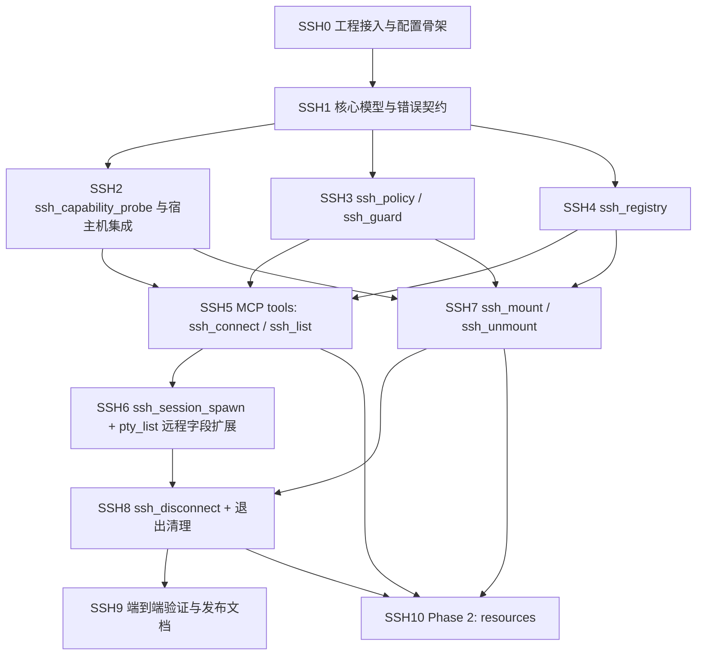

# SSH_IMPL.md

## 目标与范围

本文档把 [`SSH_DESIGN.md`](/Users/wangbowei/workspace/pty-mcp/docs/SSH_DESIGN.md) 落成可执行的实现计划，建立在当前已完成的 PTY MCP server 基础之上，优先覆盖第一阶段的 **tool-first SSH control plane**，并为第二阶段 `resources` 预留明确边界。

这里的 SSH 支持不是另起炉灶重做一套终端系统，而是在既有 PTY、session、buffer、permission、resource、task 基座上补齐：

- `ssh_connection`
- `pty_session` with `transport="ssh"`
- `ssh_mount`
- `ssh_connect` / `ssh_session_spawn` / `ssh_mount` / `ssh_unmount` / `ssh_list` / `ssh_disconnect`

实现范围必须坚持：

- 远程 session 继续复用 `pty_read` / `pty_write` / `pty_wait` / `pty_kill`
- 连接与挂载必须作为独立对象建模
- 能力发现必须显式，不能在工具内部静默 fallback
- 宿主机已安装的 `ssh` / `sshfs` / `macFUSE` 视为外部系统依赖，由服务端探测并调用

## 当前进度

截至 `de76133 feat: add ssh remote session spawning`，第一阶段的前半段已经落地并提交。

已完成提交：

- `52572d8 feat: scaffold ssh subsystem`
- `595a922 feat: add ssh domain contracts`
- `df8434d feat: probe ssh host capabilities`
- `b16e2cd feat: enforce ssh access policy`
- `5aeb081 feat: track ssh registry relationships`
- `ec540ea feat: add ssh connect and list tools`
- `de76133 feat: add ssh remote session spawning`

截至当前代码状态，已经具备可直接复用的基础设施：

- PTY 第一阶段主路径已完成，见 [`IMPL.md`](/Users/wangbowei/workspace/pty-mcp/docs/IMPL.md)
- `session_registry`、`pty_runtime`、`buffer_store`、`permission_guard` 已稳定
- MCP `tools`、`resources`、`tasks` 基础能力已接入
- SSH 对象模型、tool 设计、宿主机环境对接边界已在 [`SSH_DESIGN.md`](/Users/wangbowei/workspace/pty-mcp/docs/SSH_DESIGN.md) 明确

截至当前代码状态，已经完成的 SSH 专项实现包括：

- `ssh_connection` / `ssh_mount` 领域模型与 SSH registry 主体结构
- SSH 专用错误码与状态机
- `pty_list` 的远程字段扩展
- `ssh_connect` / `ssh_session_spawn` / `ssh_list`
- SSH Phase 2 `resources`
- `ssh_capability_probe`、`ssh_runtime` 中的连接验证与远程 session spawn plan
- SSH 策略校验
- SSH 相关模型测试、capability probe 测试、策略测试、tool 契约测试

## 实现目标

第一阶段发布必须满足：

- 仅依赖 MCP `tools` 即可完成 `ssh_connect -> ssh_session_spawn -> pty_* -> ssh_disconnect`
- 仅依赖 MCP `tools` 即可完成 `ssh_connect -> ssh_mount -> 本地工具访问 -> ssh_unmount -> ssh_disconnect`
- `pty_list` 可以明确区分本地 session 和远程 session
- `ssh_connect` 明确返回 capability 信息，而不是隐含依赖宿主机环境
- `ssh_session_spawn` 复用现有 PTY 读写等待接口，不新增 `ssh_read` / `ssh_write` / `ssh_wait` / `ssh_kill`
- `ssh_mount` 返回的 `local_path` 可以直接用于本地文件读写、搜索与编辑
- 错误具有稳定错误码，而不是仅返回自由文本
- 具备基础的宿主机二进制探测、目标策略、挂载路径策略和退出清理能力

第二阶段是增强项：

- 第二阶段：只读 `resources`

当前不单独规划 SSH 专用 `tasks`：

- 远程 session 已继续复用 PTY session 模型
- 现有 task bridge 已足以承载 `ssh_session_spawn` 产生的 session 生命周期

## 推荐代码布局

建议在现有布局基础上新增 SSH 模块：

```text
src/
  main.rs
  lib.rs
  app.rs
  config.rs
  error.rs
  session/
    mod.rs
    model.rs
    registry.rs
  pty/
    mod.rs
    runtime.rs
  permission/
    mod.rs
    guard.rs
    policy.rs
  ssh/
    mod.rs
    model.rs
    registry.rs
    runtime.rs
    capability_probe.rs
    guard.rs
    policy.rs
  mcp/
    mod.rs
    service.rs
    tools.rs
    resources.rs
    tasks.rs
tests/
  ssh_model_contract.rs
  ssh_capability_probe.rs
  ssh_policy.rs
  ssh_tool_contract.rs
  ssh_mount_lifecycle.rs
```

布局原则：

- [`src/app.rs`](/Users/wangbowei/workspace/pty-mcp/src/app.rs) 继续作为总编排入口，同时持有 PTY 与 SSH 子系统
- `ssh_runtime` 只负责调用系统 `ssh` / `sshfs` / 卸载命令，并封装平台差异
- `ssh_capability_probe` 只负责探测宿主机能力，不混入连接、挂载状态机
- `ssh_registry` 只维护连接、挂载及其与 session 的引用关系
- MCP 层仍只负责 schema、参数解包、错误映射，不直接持有 SSH 命令拼接细节
- 第一阶段不要求拆出 SSH 专用 `resources` 文件；若后续体量增大，再考虑从 [`src/mcp/resources.rs`](/Users/wangbowei/workspace/pty-mcp/src/mcp/resources.rs) 分离

## 建议依赖

在现有依赖基础上，第一阶段建议尽量不新增重型 SSH/FUSE 运行时依赖：

- 继续复用现有 `tokio`、`serde`、`schemars`、`thiserror`、`chrono`
- 继续复用现有 PTY 基座，不引入额外 SSH client crate 或 FUSE 绑定
- 通过系统二进制完成：
  - `ssh`
  - `sshfs`
  - `umount` / `diskutil`

如需补充测试辅助，可考虑新增轻量测试依赖：

- `tempfile`

依赖原则：

- 第一版不引入 `libssh`、`openssh`、`libfuse` 一类重型绑定
- SSH 配置解析优先复用系统 `ssh` 行为，而不是在服务端复制一套 OpenSSH 配置解释器
- 宿主机对接优先依赖显式配置和绝对路径探测，而不是仅依赖运行时 `PATH`

## 配置项建议

建议在 [`src/config.rs`](/Users/wangbowei/workspace/pty-mcp/src/config.rs) 中把 SSH 配置拆成“结构体字段 + 环境变量映射”两层：

- `ssh_bin_path`
  - `PTY_MCP_SSH_BIN_PATH`
- `sshfs_bin_path`
  - `PTY_MCP_SSHFS_BIN_PATH`
- `umount_bin_path`
  - `PTY_MCP_UMOUNT_BIN_PATH`
- `diskutil_bin_path`
  - `PTY_MCP_DISKUTIL_BIN_PATH`
- `managed_mount_root`
  - `PTY_MCP_SSH_MANAGED_MOUNT_ROOT`
- `allowed_hosts`
  - `PTY_MCP_SSH_ALLOWED_HOSTS`
- `denied_hosts`
  - `PTY_MCP_SSH_DENIED_HOSTS`
- `allowed_users`
  - `PTY_MCP_SSH_ALLOWED_USERS`
- `port_min`
  - `PTY_MCP_SSH_PORT_MIN`
- `port_max`
  - `PTY_MCP_SSH_PORT_MAX`

解析建议：

- 主机、用户列表先按 CSV 解析
- 端口范围第一版先支持单个闭区间，避免一开始就引入复杂 range DSL
- `managed_mount_root` 若存在，应在运行时自动并入本地 `allowed_cwd_roots`，避免挂载成功后仍无法访问
- 二进制路径若未显式配置，则按“平台常见绝对路径 -> PATH”继续探测

## 实施 DAG

下面的 DAG 表示推荐的落地顺序，不是运行时架构图。



并行建议：

- `SSH2`、`SSH3`、`SSH4` 可以在 `SSH1` 完成后并行推进
- `SSH6` 与 `SSH7` 在连接模型和 registry 稳定后可以并行推进
- `SSH10` 必须建立在第一阶段稳定之后，不能反过来驱动核心设计

## 任务步骤

### SSH0. 工程接入与配置骨架

状态：

- 已完成

依赖：

- 现有 PTY `S0` 到 `S10`

代码改动范围：

- [`Cargo.toml`](/Users/wangbowei/workspace/pty-mcp/Cargo.toml)
- [`src/lib.rs`](/Users/wangbowei/workspace/pty-mcp/src/lib.rs)
- [`src/app.rs`](/Users/wangbowei/workspace/pty-mcp/src/app.rs)
- [`src/config.rs`](/Users/wangbowei/workspace/pty-mcp/src/config.rs)
- [`src/mcp/mod.rs`](/Users/wangbowei/workspace/pty-mcp/src/mcp/mod.rs)
- [`src/main.rs`](/Users/wangbowei/workspace/pty-mcp/src/main.rs)

任务内容：

- 增加 `ssh` 模块骨架和 `AppState` 中的 SSH 子系统入口
- 增加 SSH 相关配置项，至少包括：
  - `ssh_bin_path`
  - `sshfs_bin_path`
  - `umount_bin_path`
  - `diskutil_bin_path`
  - `managed_mount_root`
  - host/user/port 策略配置
- 让配置加载支持“显式配置 -> 平台常见绝对路径 -> PATH fallback”的优先级
- 为后续 `ssh_connect` / `ssh_mount` 等工具预留 AppState 调用入口
- 明确 server shutdown 时的 SSH 清理挂点

验收标准：

- `cargo check` 通过
- 新增 SSH 模块骨架后，不破坏现有 PTY 主路径
- 配置项在不启用 SSH 功能时保持向后兼容

完成情况：

- 已完成，并提交于 `52572d8 feat: scaffold ssh subsystem`
- `src/ssh/*` 模块骨架、`AppState` SSH 子系统入口、SSH 配置骨架、shutdown hook 已落地

### SSH1. 核心模型与错误契约

状态：

- 已完成

依赖：

- `SSH0`

代码改动范围：

- [`src/error.rs`](/Users/wangbowei/workspace/pty-mcp/src/error.rs)
- [`src/ssh/mod.rs`](/Users/wangbowei/workspace/pty-mcp/src/ssh/mod.rs)
- [`src/ssh/model.rs`](/Users/wangbowei/workspace/pty-mcp/src/ssh/model.rs)
- [`src/session/model.rs`](/Users/wangbowei/workspace/pty-mcp/src/session/model.rs)
- [`tests/ssh_model_contract.rs`](/Users/wangbowei/workspace/pty-mcp/tests/ssh_model_contract.rs)

任务内容：

- 定义 `SshConnectionId`、`SshMountId`
- 定义 `SshConnectionStatus`、`SshMountStatus`
- 定义 `SshCapabilityView`
- 定义 `SshConnectionSummary`、`SshMountSummary`
- 扩展现有 session 模型，增加：
  - `transport`
  - `connection_id`
  - `target_summary`
  - `remote_cwd`
  - `remote_command`
  - `remote_env_preview`
- 增加 SSH 错误码，至少覆盖：
  - `SSH_CONNECTION_NOT_FOUND`
  - `SSH_CONNECTION_NOT_READY`
  - `SSH_AUTH_FAILED`
  - `SSH_HOST_UNREACHABLE`
  - `SSH_HOST_KEY_REJECTED`
  - `SSH_CAPABILITY_UNAVAILABLE`
  - `SSH_MOUNT_NOT_FOUND`
  - `SSH_MOUNT_FAILED`
  - `SSH_UNMOUNT_FAILED`
  - `SSH_ACTIVE_SESSION_EXISTS`
  - `SSH_ACTIVE_MOUNT_EXISTS`

验收标准：

- 所有 SSH 状态和错误对象都可 `serde` 序列化
- `pty_list` 所需远程字段已进入领域模型，而不是工具层临时拼装
- SSH 错误码不会退化成自由文本

完成情况：

- 已完成，并提交于 `595a922 feat: add ssh domain contracts`
- `SessionSummary` 已包含 `transport`、`connection_id`、`target_summary`、`remote_cwd`、`remote_command`、`remote_env_preview`

### SSH2. `ssh_capability_probe` 与宿主机集成

状态：

- 已完成

依赖：

- `SSH1`

代码改动范围：

- [`src/ssh/capability_probe.rs`](/Users/wangbowei/workspace/pty-mcp/src/ssh/capability_probe.rs)
- [`src/config.rs`](/Users/wangbowei/workspace/pty-mcp/src/config.rs)
- [`src/app.rs`](/Users/wangbowei/workspace/pty-mcp/src/app.rs)
- [`tests/ssh_capability_probe.rs`](/Users/wangbowei/workspace/pty-mcp/tests/ssh_capability_probe.rs)

任务内容：

- 探测系统 `ssh`、`sshfs`、卸载命令是否存在
- 记录解析出的绝对路径、版本、平台信息
- 在 macOS 上额外识别 `macFUSE` 提供者信息
- 输出稳定 capability 视图，供 `ssh_connect` 和 `ssh_list` 返回
- 通过配置覆盖支持：
  - GUI host 启动时的 `PATH` 漂移
  - 测试环境中的假二进制注入

验收标准：

- 缺少 `ssh`、`sshfs`、卸载命令时，能力视图可稳定区分“存在/不存在”
- 探测优先级满足“显式配置 -> 绝对路径 -> PATH”
- 单元测试不依赖开发者本机的真实二进制布局

完成情况：

- 已完成，并提交于 `df8434d feat: probe ssh host capabilities`
- 当前实现已支持假二进制注入测试，并把 capability 视图缓存到 `AppState`

### SSH3. `ssh_policy` / `ssh_guard`

状态：

- 已完成

依赖：

- `SSH1`

代码改动范围：

- [`src/ssh/policy.rs`](/Users/wangbowei/workspace/pty-mcp/src/ssh/policy.rs)
- [`src/ssh/guard.rs`](/Users/wangbowei/workspace/pty-mcp/src/ssh/guard.rs)
- [`src/config.rs`](/Users/wangbowei/workspace/pty-mcp/src/config.rs)
- [`tests/ssh_policy.rs`](/Users/wangbowei/workspace/pty-mcp/tests/ssh_policy.rs)

任务内容：

- 定义 host allowlist / denylist
- 定义可选 user allowlist
- 定义端口范围限制
- 定义可接受的认证来源策略：
  - `host_alias`
  - `ssh-agent`
  - `identity_path`
- 定义挂载本地路径策略：
  - 仅允许系统分配的托管挂载目录
  - 或仅允许位于受控根目录下的显式路径
- 对 `identity_path`、`local_path`、`remote_path` 做同步校验，避免 runtime 再夹杂策略判断

验收标准：

- 被策略拒绝的主机、用户、端口、挂载路径会稳定返回 `PERMISSION_DENIED` 或 `INVALID_ARGUMENT`
- 未通过策略校验的请求不会进入 `ssh_runtime`
- 托管挂载目录策略与本地 `cwd` allowlist 关系清晰可验证

完成情况：

- 已完成，并提交于 `b16e2cd feat: enforce ssh access policy`
- 当前实现额外包含 `allowed_auth_kinds`、`allow_explicit_mount_paths`、`allowed_mount_roots`

### SSH4. `ssh_registry`

状态：

- 已完成

依赖：

- `SSH1`

代码改动范围：

- [`src/ssh/registry.rs`](/Users/wangbowei/workspace/pty-mcp/src/ssh/registry.rs)
- [`src/app.rs`](/Users/wangbowei/workspace/pty-mcp/src/app.rs)
- [`tests/ssh_tool_contract.rs`](/Users/wangbowei/workspace/pty-mcp/tests/ssh_tool_contract.rs)

任务内容：

- 让 registry 成为 `ssh_connection` 与 `ssh_mount` 的唯一事实来源
- 管理连接状态机和挂载状态机
- 保存 connection 与 session 的引用关系
- 保存 connection 与 mount 的引用关系
- 维护：
  - `active_session_count`
  - `active_mount_count`
  - `last_used_at`
- 为 `ssh_disconnect` 提供级联清理所需的关系查询

验收标准：

- `ssh_list` 所需摘要字段全部由 registry 提供
- 同一连接下可以稳定跟踪多个 session 和多个 mount
- 有活跃 session 或 mount 时，可以稳定拒绝直接 disconnect

完成情况：

- 已完成，并提交于 `5aeb081 feat: track ssh registry relationships`
- 当前 registry 已维护连接、挂载、session 的关系索引与 `active_*_count` / `last_used_at`

### SSH5. MCP tools：`ssh_connect` / `ssh_list`

状态：

- 已完成

依赖：

- `SSH2`
- `SSH3`
- `SSH4`

代码改动范围：

- [`src/mcp/tools.rs`](/Users/wangbowei/workspace/pty-mcp/src/mcp/tools.rs)
- [`src/ssh/runtime.rs`](/Users/wangbowei/workspace/pty-mcp/src/ssh/runtime.rs)
- [`src/app.rs`](/Users/wangbowei/workspace/pty-mcp/src/app.rs)
- [`src/mcp/service.rs`](/Users/wangbowei/workspace/pty-mcp/src/mcp/service.rs)
- [`tests/ssh_tool_contract.rs`](/Users/wangbowei/workspace/pty-mcp/tests/ssh_tool_contract.rs)

任务内容：

- 实现 `ssh_connect`
- 实现 `ssh_list`
- `ssh_connect` 优先支持 `host_alias`
- 通过系统 `ssh` 进行配置解析和连通性校验
- 返回 capability 视图和可复用 `connection_id`
- 支持 `reused=true` 的连接复用语义
- 默认不泄露敏感认证细节

验收标准：

- `ssh_connect` 返回 `connection_id`、`status`、`target`、`started_at`、`capabilities`
- 在宿主机缺少能力时，返回稳定的 `SSH_CAPABILITY_UNAVAILABLE`
- `ssh_list` 仅返回摘要，不暴露敏感信息

完成情况：

- 已完成，并提交于 `ec540ea feat: add ssh connect and list tools`
- 当前 `ssh_connect` 已支持 capability 检查、策略校验、系统 `ssh` 连通性验证、连接复用

### SSH6. `ssh_session_spawn` + `pty_list` 远程字段扩展

状态：

- 已完成

依赖：

- `SSH5`

代码改动范围：

- [`src/mcp/tools.rs`](/Users/wangbowei/workspace/pty-mcp/src/mcp/tools.rs)
- [`src/app.rs`](/Users/wangbowei/workspace/pty-mcp/src/app.rs)
- [`src/ssh/runtime.rs`](/Users/wangbowei/workspace/pty-mcp/src/ssh/runtime.rs)
- [`src/session/model.rs`](/Users/wangbowei/workspace/pty-mcp/src/session/model.rs)
- [`src/session/registry.rs`](/Users/wangbowei/workspace/pty-mcp/src/session/registry.rs)
- [`tests/ssh_tool_contract.rs`](/Users/wangbowei/workspace/pty-mcp/tests/ssh_tool_contract.rs)

任务内容：

- 实现 `ssh_session_spawn`
- 把远程命令启动映射为“本地启动 `ssh` 客户端 + 现有 PTY runtime”
- `session_id` 必须继续适用于 `pty_read` / `pty_write` / `pty_wait` / `pty_kill`
- `interactive=true` 时可启动远程 shell
- `command` 缺失时，视为开启远程交互 shell
- `cwd` 必须表达远程工作目录，而不是本地工作目录
- 更新 `pty_list`，让远程 session 可见 `transport="ssh"` 等字段

验收标准：

- 远程 session 能完整复用既有 PTY 主路径
- `pty_list` 可以明显区分本地 shell 和远程 shell
- `ssh_session_spawn` 不向 agent 暴露原始 SSH 命令拼接细节

完成情况：

- 已完成，并提交于 `de76133 feat: add ssh remote session spawning`
- 当前 `ssh_session_spawn` 已通过现有 PTY runtime 启动本地 `ssh` 客户端
- 当前 `pty_list` 已能展示远程 session 的 `transport="ssh"` 及相关远程上下文字段

### SSH7. `ssh_mount` / `ssh_unmount`

状态：

- 已完成（当前工作区）

依赖：

- `SSH2`
- `SSH3`
- `SSH4`

代码改动范围：

- [`src/mcp/tools.rs`](/Users/wangbowei/workspace/pty-mcp/src/mcp/tools.rs)
- [`src/ssh/runtime.rs`](/Users/wangbowei/workspace/pty-mcp/src/ssh/runtime.rs)
- [`src/ssh/registry.rs`](/Users/wangbowei/workspace/pty-mcp/src/ssh/registry.rs)
- [`src/config.rs`](/Users/wangbowei/workspace/pty-mcp/src/config.rs)
- [`tests/ssh_mount_lifecycle.rs`](/Users/wangbowei/workspace/pty-mcp/tests/ssh_mount_lifecycle.rs)

任务内容：

- 实现 `ssh_mount`
- 实现 `ssh_unmount`
- 第一版仅实现 `backend="sshfs"`
- `ssh_mount` 直接调用系统 `sshfs`
- `ssh_unmount` 封装平台差异：
  - macOS 优先 `umount`
  - `force=true` 时映射 `umount -f`
  - 失败时可受控尝试 `diskutil unmount force`
- 要求调用方显式提供 `local_path`
- 仅在受控条件下允许 `cleanup_local_path=true`
- 记录挂载失败原因到 `last_error`

验收标准：

- 挂载成功后返回的 `local_path` 可直接用于本地工具访问
- 宿主机缺少 `sshfs` 时返回稳定的 `SSH_CAPABILITY_UNAVAILABLE`
- 对不存在的挂载执行卸载时返回稳定的 `SSH_MOUNT_NOT_FOUND`
- `cleanup_local_path=true` 不会误删非托管目录

完成情况：

- 已完成（当前工作区）
- 当前实现已补齐 `ssh_mount` / `ssh_unmount` MCP tools 与 `AppState` 主路径
- 当前实现已接入系统 `sshfs`、`umount`，并在 macOS 上预留 `diskutil` forced unmount fallback
- 当前实现要求显式 `local_path`，并保留受控目录清理与挂载失败 `last_error` 回写
- 当前实现已补充 [`tests/ssh_mount_lifecycle.rs`](/Users/wangbowei/workspace/pty-mcp/tests/ssh_mount_lifecycle.rs) 覆盖 capability 缺失、托管目录清理边界、挂载失败记录、shutdown 清理

### SSH8. `ssh_disconnect` + 退出清理

状态：

- 已完成（当前工作区）

依赖：

- `SSH6`
- `SSH7`

代码改动范围：

- [`src/mcp/tools.rs`](/Users/wangbowei/workspace/pty-mcp/src/mcp/tools.rs)
- [`src/app.rs`](/Users/wangbowei/workspace/pty-mcp/src/app.rs)
- [`src/ssh/registry.rs`](/Users/wangbowei/workspace/pty-mcp/src/ssh/registry.rs)
- [`src/ssh/runtime.rs`](/Users/wangbowei/workspace/pty-mcp/src/ssh/runtime.rs)
- [`src/main.rs`](/Users/wangbowei/workspace/pty-mcp/src/main.rs)
- [`tests/ssh_tool_contract.rs`](/Users/wangbowei/workspace/pty-mcp/tests/ssh_tool_contract.rs)
- [`tests/ssh_mount_lifecycle.rs`](/Users/wangbowei/workspace/pty-mcp/tests/ssh_mount_lifecycle.rs)

任务内容：

- 实现 `ssh_disconnect`
- 默认若仍有活跃远程 session 或挂载，则拒绝断开
- `force=true` 时允许级联清理
- `cleanup_mounts=true` 时显式卸载相关挂载
- server shutdown 时：
  - 先卸载托管挂载
  - 再清理远程 session
  - 最后继续现有 PTY shutdown 流程

验收标准：

- `ssh_disconnect` 返回 `previous_status`、`current_status`、`closed_sessions`、`closed_mounts`
- 活跃资源存在时默认不会静默级联销毁
- 服务端退出后不会遗留托管挂载

完成情况：

- 已完成（当前工作区）
- 当前实现已补齐 `ssh_disconnect` MCP tool 与 `AppState::ssh_disconnect`
- 当前实现默认拒绝带活跃资源的 disconnect；仅在 `force=true` 时允许级联清理
- 当前实现要求 `cleanup_mounts=true` 才会主动卸载相关挂载，避免静默销毁 mount
- 当前实现已把 `shutdown_ssh` 接到统一退出流程，在 server shutdown 时先执行 SSH 级联清理，再继续 PTY shutdown
- 当前实现已补充 [`tests/ssh_tool_contract.rs`](/Users/wangbowei/workspace/pty-mcp/tests/ssh_tool_contract.rs) 中的 force disconnect 契约覆盖

### SSH9. 端到端验证与发布文档

状态：

- 已完成（当前工作区）

依赖：

- `SSH8`

代码改动范围：

- [`tests/ssh_tool_contract.rs`](/Users/wangbowei/workspace/pty-mcp/tests/ssh_tool_contract.rs)
- [`tests/ssh_mount_lifecycle.rs`](/Users/wangbowei/workspace/pty-mcp/tests/ssh_mount_lifecycle.rs)
- [`README.md`](/Users/wangbowei/workspace/pty-mcp/README.md)
- [`docs/SSH_IMPL.md`](/Users/wangbowei/workspace/pty-mcp/docs/SSH_IMPL.md)
- [`docs/SSH_DESIGN.md`](/Users/wangbowei/workspace/pty-mcp/docs/SSH_DESIGN.md)

任务内容：

- 覆盖 [`SSH_DESIGN.md`](/Users/wangbowei/workspace/pty-mcp/docs/SSH_DESIGN.md) 定义的三个最小可用工作流：
  - 建立远程 shell 并执行命令
  - 挂载远程仓库并本地编辑
  - 同一连接下管理多个远程作业
- 补齐配置说明、错误码说明、宿主机依赖说明
- 补齐 macOS 与 Linux 的手动 smoke test 指南
- 默认测试应使用假二进制和受控假响应，不依赖真实外部主机

验收标准：

- `cargo test` 覆盖核心契约、策略、capability probe、session/mount 生命周期
- 第一阶段核心功能不依赖 `resources`
- 文档能支撑首次把 SSH 能力接入 MCP host

完成情况：

- 已完成（当前工作区）
- 当前实现已补齐 [`README.md`](/Users/wangbowei/workspace/pty-mcp/README.md) 的 SSH tool contract、配置项、宿主机依赖与 smoke test 说明
- 当前实现已把 [`docs/SSH_IMPL.md`](/Users/wangbowei/workspace/pty-mcp/docs/SSH_IMPL.md) 与实际代码状态对齐
- 当前实现维持“SSH Phase 1 tool-first 与 Phase 2 resources 均已完成”的发布口径

### SSH10. Phase 2：`resources`

状态：

- 已完成（当前工作区）

依赖：

- `SSH5`
- `SSH7`
- `SSH8`

代码改动范围：

- [`src/mcp/resources.rs`](/Users/wangbowei/workspace/pty-mcp/src/mcp/resources.rs)
- [`src/mcp/service.rs`](/Users/wangbowei/workspace/pty-mcp/src/mcp/service.rs)
- [`tests/ssh_tool_contract.rs`](/Users/wangbowei/workspace/pty-mcp/tests/ssh_tool_contract.rs)

任务内容：

- 提供：
  - `ssh://connections`
  - `ssh://connections/{id}`
  - `ssh://mounts`
  - `ssh://mounts/{id}`
- 资源读取直接复用 `ssh_registry` 的只读模型
- 远程 session 继续通过现有 `pty://sessions` 资源体系暴露

验收标准：

- resources 只增强观察面，不改变第一阶段 tools 主路径
- `ssh://*` 资源输出与 `ssh_list` 的核心字段保持一致

完成情况：

- 已完成（当前工作区）
- 当前实现已在 [`src/mcp/resources.rs`](/Users/wangbowei/workspace/pty-mcp/src/mcp/resources.rs) 提供 `ssh://connections`、`ssh://connections/{id}`、`ssh://mounts`、`ssh://mounts/{id}`
- 当前实现直接复用 `ssh_registry` / `AppState` 的只读摘要模型，不新增 SSH 资源专用 DTO
- 当前实现已在 [`src/mcp/service.rs`](/Users/wangbowei/workspace/pty-mcp/src/mcp/service.rs) 的 server instructions 中补充 SSH resource 发现入口
- 当前实现已在 [`tests/ssh_tool_contract.rs`](/Users/wangbowei/workspace/pty-mcp/tests/ssh_tool_contract.rs) 补充 MCP resource 契约测试，校验列表与单项读取均与 `ssh_list` 核心字段一致

## 第一阶段里程碑定义

达到以下条件即可认为 SSH 第一阶段完成：

- 六个工具 `ssh_connect`、`ssh_session_spawn`、`ssh_mount`、`ssh_unmount`、`ssh_list`、`ssh_disconnect` 全部可用
- `pty_list` 已包含远程 session 所需上下文字段
- 工具结果为结构化输出，错误具有稳定错误码
- 能力探测、目标策略、挂载路径策略、优雅退出均已生效
- `cargo test` 覆盖远程 shell、挂载、本地访问、disconnect 的核心工作流

截至当前工作区状态，SSH 第一阶段与 Phase 2 `resources` 已全部完成。

## 关键设计决策与提前校验项

这些点建议在 `SSH0` 或 `SSH1` 就确认，否则会在中段返工：

- `ssh_connect` 的“连接”应视为已验证、可复用的目标句柄，而不是必须常驻的 TCP control master
- `ssh_session_spawn` 应通过现有 PTY runtime 启动本地 `ssh` 客户端，而不是新造一套远程 IO runtime
- `sshfs` 挂载的真相来源应是 mount 对象和挂载点，而不是某个不稳定的后台进程 PID
- 宿主机能力探测必须优先显式配置和绝对路径，不能只依赖 `PATH`
- 托管挂载目录必须与现有本地 `cwd` 权限策略协调，否则挂载成功后仍可能无法访问
- CI 和默认测试不应依赖真实外部 SSH 主机；应优先使用假二进制与假响应做稳定测试
- 第一版不应自己重写 OpenSSH 配置解析；应尽可能复用系统 `ssh` 行为

## 非目标

SSH 第一阶段明确不做：

- 工具参数直接传明文 `password`
- 工具参数直接传私钥正文或 passphrase 明文
- Windows 平台下的 SSH/FUSE 兼容层
- 端口转发、反向代理、SOCKS、SFTP 独立对象模型
- 任何要求 agent 自己拼接原始 `ssh` / `sshfs` 命令作为主路径的方案
- 自动安装 `ssh`、`sshfs`、`macFUSE`
- 任何必须依赖 `resources` 或新增 SSH 专用 `tasks` 才能完成的核心工作流
